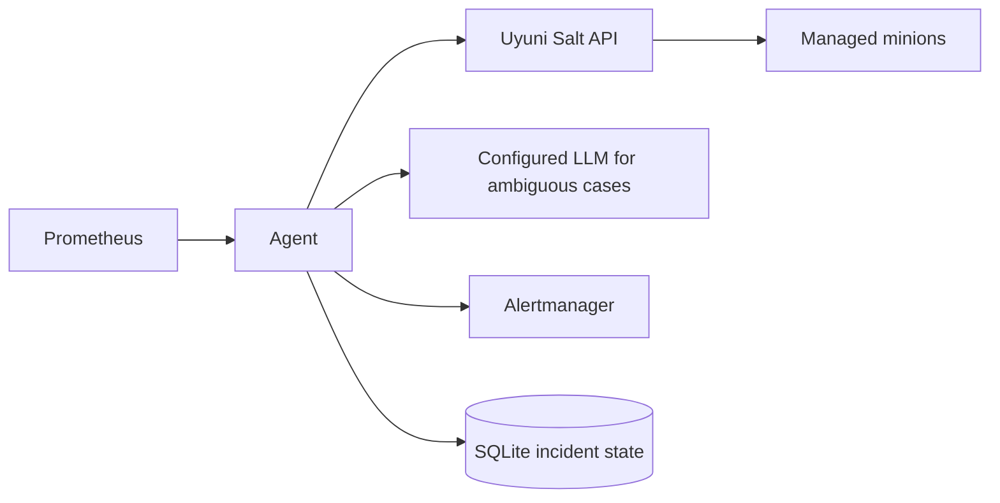

# GSoC'26 AI-Powered Monitoring Agent for Uyuni

> **Google Summer of Code 2026 project for openSUSE**
>
> This project was developed for [Google Summer of Code 2026 with
openSUSE](https://www.opensuse.org/), under the original [AI-Powered
Intelligent Monitoring and Root Cause Analysis for Uyuni
proposal](https://github.com/openSUSE/mentoring/issues/251). Mentors were Jordi
Massaguer and Oscar Barrios. The [GSoC final report](docs/gsoc-final-report.md)
is the evaluation and handover document for this repository.

The Uyuni AI Agent provides evidence-driven incident investigation for
[Uyuni](https://www.uyuni-project.org/). It detects anomalous telemetry from
Prometheus, collects bounded read-only diagnostic evidence through Uyuni's Salt
API, and sends structured root-cause analysis to Alertmanager.

It is a backend monitoring service and an operational safety boundary: it can
inspect managed systems, but it does not execute remediation chosen by an LLM.
Unsupported, stale, failed, or contradictory evidence produces an
`inconclusive` result instead of a confident guess.

## Capabilities

- CPU, memory, active swap pressure, disk, service, Apache, and PostgreSQL
  anomaly detection.
- Deterministic evidence collection and proven root-cause patterns for common
  incidents.
- LangGraph-based investigation for ambiguous cases through a configured LLM.
- Evidence IDs, freshness checks, contradiction handling, and structured RCA
  output.
- Privacy-preserving LangSmith visibility for both LLM and deterministic RCA
  paths.
- Durable SQLite incident lifecycle across restarts.
- Bounded priority queue, concurrency limits, retry, circuit breakers, and
  operation deadlines.
- Alertmanager firing and exact-identity resolution notifications.
- `/healthz`, `/readyz`, and low-cardinality Prometheus metrics.
- Non-root, digest-pinned container with hash-locked dependencies and CI SBOM.

## How it works



Every polling cycle queries configured Prometheus targets and service state,
reconciles anomalies with durable incident state, and queues new or retryable
investigations. Evidence is collected through bounded tools. Known patterns can
be analyzed without the LLM; other cases use the configured provider and then
pass through the same evidence-grounding quality gates.

See [Architecture](docs/architecture.md) for lifecycle, failure, persistence,
and component details.

## Requirements

The repository expects these systems to already exist:

- Uyuni server and managed minions;
- Uyuni Salt REST API (`rest_cherrypy`, normally port 9080);
- Prometheus with node, Apache, and/or PostgreSQL metrics as configured;
- Alertmanager;
- an approved OpenAI-compatible, Google, Hugging Face, or TokenRouter model;
- Podman, systemd, and Quadlet for the supplied production deployment.

The Salt identity should be dedicated, read-only at the application level, and
limited to intended targets and inspection functions. See [Security](docs/security.md).

## Quick start

For local development, see [Development](docs/development.md). The shortest
safe production-shaped path is:

```bash
podman build --format=docker \
  -t localhost/uyuni-ai-agent:production -f Containerfile .

sudo install -m 0644 deploy/agent/uyuni-ai-agent.container \
  /etc/containers/systemd/uyuni-ai-agent.container
sudo systemctl daemon-reload
sudo systemctl enable --now uyuni-ai-agent.service
```

The checked-in Quadlet starts with `--dry-run`. Configure endpoints, exact
minion IDs, thresholds, and secrets before starting it. Remove `--dry-run` only
after detection, investigation, Alertmanager routing, and resolution behavior
have been verified in the target environment.

Expose metrics only through the supplied source-restricted proxy:

```bash
sudo deploy/agent/install-metrics-proxy.sh MONITORING_SERVER_IP
sudo deploy/monitoring/install-agent-monitoring.sh UYUNI_HOSTNAME_OR_IP
```

Do not publish port 9898 broadly. The container backend is published to host
loopback at port 19898 and the proxy restricts remote access to the monitoring
host.

## Configuration and secrets

The example configuration is [config/settings.yaml](config/settings.yaml).
Values are validated at startup by the Pydantic schema. Endpoint overrides and
secrets are documented in [Configuration](docs/configuration.md).

Copy `.env.example` to `.env` for development. Production secrets belong in a
root-readable environment file, not in YAML, the image, command-line arguments,
logs, or Git:

- `LLM_API_KEY`
- `SALT_API_PASSWORD`
- `LANGSMITH_API_KEY` when tracing is enabled

## Health checks

On the Uyuni host:

```bash
curl -fsS http://127.0.0.1:19898/healthz
curl -fsS http://127.0.0.1:19898/readyz
curl -fsS http://127.0.0.1:19898/metrics
systemctl status uyuni-ai-agent.service --no-pager
podman logs --since 10m ai-agent
```

`healthz` means the process and listener are alive. `readyz` additionally
requires a recent usable poll and required dependency checks. See
[Operations](docs/operations.md) and the [runbooks](docs/runbooks/README.md).

## Development and evaluation

```bash
pytest -q -p no:cacheprovider
ruff check .
```

CI also audits dependencies, generates a CycloneDX SBOM, and verifies the
container runs as UID/GID `10001:10001`.

The scenario catalog in [evaluation/scenarios.yaml](evaluation/scenarios.yaml)
covers CPU, service, disk, PostgreSQL, memory, cross-node correlation,
dependency outages, stale telemetry, unrelated alerts, and queue backpressure.
See [Evaluation](docs/evaluation.md) for the acceptance contract and required
live-validation artifacts.

## Documentation

Use the [documentation index](docs/README.md) to find the right guide:

- [Architecture](docs/architecture.md): components, data flow, evidence,
  retries, queues, persistence, and failure behavior.
- [Configuration](docs/configuration.md): every setting, environment variable,
  default, validation rule, and tuning concern.
- [Development](docs/development.md): local setup and extension workflow.
- [Operations](docs/operations.md): deployment, health, monitoring, upgrade,
  rollback, and dependency testing.
- [Security model](docs/security.md): trust boundaries, Salt permissions, data
  minimization, model risk, and network exposure.
- [Alert contract](docs/alert-contract.md): labels, annotations, payloads,
  delivery, and resolution identity.
- [Runbooks](docs/runbooks/README.md): response procedures for self-monitoring
  alerts.
- [Evaluation](docs/evaluation.md): scenario-based RCA quality checks.
- [GSoC 2026 final report](docs/gsoc-final-report.md): project accomplishments,
  validation, code cutoff, and concrete remaining tasks.
- [ADRs](docs/adr/README.md): rationale behind durable design choices.

Contribution and vulnerability-reporting policies are in
[CONTRIBUTING.md](CONTRIBUTING.md) and [SECURITY.md](SECURITY.md).

## Project status

The GSoC implementation is complete as of the cutoff recorded in the [final
report](docs/gsoc-final-report.md). The repository may receive future
maintenance and environment-specific release work: model/provider
compatibility, deployment topology, thresholds, Salt permissions, and
notification routing still need to be tuned for each installation. Use dry-run
and the evaluation catalog before enabling production delivery.

## License

Copyright 2026 Digvijay Rawat.

Licensed under the Apache License, Version 2.0. See [LICENSE](LICENSE) for the
full text.
