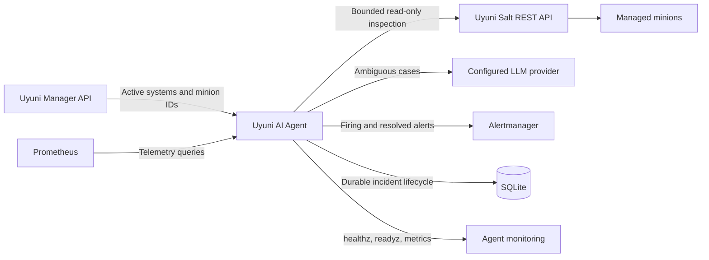
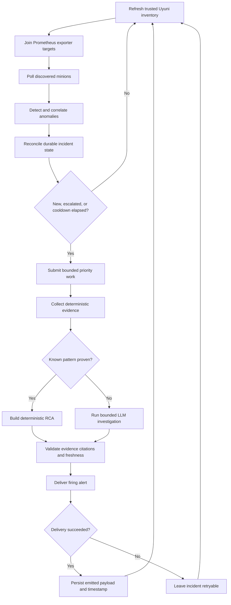

# Architecture

## Purpose

The Uyuni AI Agent detects infrastructure anomalies, gathers bounded diagnostic
evidence through Uyuni's Salt API, produces an evidence-grounded root-cause
analysis (RCA), and sends firing and resolved notifications to Alertmanager.

The service is designed to fail conservatively. Missing, stale, contradictory,
or insufficient evidence produces an inconclusive result instead of a
confident operational claim.

## System context

The production process runs as a non-root Podman container on the Uyuni
server's managed `uyuni` network. Prometheus, Alertmanager, Uyuni, its minions,
and the LLM endpoint are external dependencies; this repository does not
provision them.

## Runtime lifecycle

When an anomaly is absent for the configured number of healthy observations,
the stored firing payload is copied, given an `endsAt` timestamp, and sent as a
resolution. Reusing the exact firing labels preserves Alertmanager identity.

## Component responsibilities

| Component | Responsibility |
|---|---|
| `main.py` | Starts dependencies, owns the poll loop, reconciles incidents, queues investigations, and coordinates shutdown |
| `config.py` and `config_schema.py` | Load YAML, overlay environment values, reject unknown or invalid settings, and normalize configuration |
| `prometheus_client.py` | Execute bounded Prometheus queries and reject unusable samples |
| `inventory.py` | Discover active Uyuni minions, join Prometheus exporter labels, cache the last-known-good inventory, and preserve Uyuni as the Salt trust boundary |
| `anomaly_detector.py` | Convert telemetry and service state into typed anomalies |
| `*_inspection.py` | Gather deterministic evidence for CPU, memory, disk, Apache, PostgreSQL, and service incidents |
| `tools/` | Expose the bounded inspection operations available to the ReAct agent |
| `salt_api.py` | Authenticate to Uyuni's Salt REST API and execute validated inspection calls |
| `deterministic_analysis.py` | Recognize evidence patterns that directly prove a root cause |
| `langsmith_tracing.py` | Emit allowlisted deterministic-decision metadata without raw evidence, configuration, targets, or RCA text |
| `react_agent.py` | Investigate ambiguous cases using the configured LLM and bounded tools |
| `evidence.py` | Assign evidence IDs, enforce freshness and status requirements, validate citations, and downgrade unsupported conclusions |
| `models.py` | Define the structured RCA contract |
| `incident_store.py` | Persist active/resolved lifecycle state, alert identity, cooldowns, and delivery state in SQLite |
| `investigation_queue.py` | Bound pending work, coalesce duplicates, prioritize severity, and apply backpressure |
| `resilience.py` | Provide dependency-specific circuits, backoff, jitter, and deadlines |
| `alert_manager.py` | Build Alertmanager v2 payloads, retry transient delivery failures, and create exact-identity resolutions |
| `observability.py` | Serve health, readiness, and low-cardinality Prometheus metrics |

## Evidence and analysis contract

Each collected fact becomes an evidence record with a stable incident-local ID
such as `E1`. A record includes its source, target, check, status, summary,
details, and observation time.

A confirmed RCA must:

1. cite existing evidence IDs;
2. identify those IDs as supporting evidence;
3. cite them in the root-cause text and evidence bullets;
4. use evidence with an acceptable status;
5. use evidence no older than `quality_gates.max_evidence_age_seconds`;
6. meet `quality_gates.minimum_supporting_records`; and
7. have no evidence record that contradicts its supporting records.

If these conditions fail, the conclusion is changed to `inconclusive`, the
affected component becomes `unknown`, confidence is capped, and remediation is
restricted to evidence restoration and operator validation. High-risk commands
such as destructive filesystem, database, shutdown, and force-kill operations
are removed from generated remediation.
The safety filter also removes SSH trust bypasses, blanket `known_hosts`
deletion, insecure TLS flags or disabled certificate verification, and
world-writable permission changes. SSH trust changes are strengthened with an
out-of-band fingerprint-verification prerequisite.

## Incident identity and acknowledgement

An incident fingerprint is a deterministic SHA-256-derived identity based on
the anomaly identity fields. It is stable across process restarts.

The agent does not acknowledge work merely because it was detected or queued.
Notification state advances only after the investigation is still current and
Alertmanager delivery succeeds. Consequently:

- rejected or evicted queue work remains eligible for a later poll;
- LLM, Salt, timeout, or delivery failures remain retryable;
- restarts do not suppress active incidents;
- severity escalation can produce a new firing payload; and
- resolution uses the last successfully emitted label set.

## Concurrency and backpressure

Three separate limits control load:

- `concurrency.max_minions` bounds minions processed in a poll cycle;
- `concurrency.max_salt_calls` bounds calls reaching Salt; and
- `concurrency.max_llm_calls` bounds LLM investigations.

The investigation queue separately bounds pending work. Duplicate incidents
are coalesced. Critical work can evict lower-priority pending work, but evicted
work is not marked delivered. Jobs older than
`investigation_queue.max_job_age_seconds` are not investigated using stale
snapshots.

## Dependency and failure behavior

| Failure | Runtime behavior | Readiness effect | Incident effect |
|---|---|---|---|
| Salt unavailable | Login and operations retry with backoff; the Salt circuit can open | Not ready when Salt is required and unavailable | Inspection remains retryable |
| Prometheus unavailable or stale | Poll records failure and rejects stale samples | Not ready without a recent usable poll | No RCA is confirmed from unusable telemetry |
| LLM unavailable | Deterministic paths continue; ambiguous investigations fail or time out | LLM is not a base readiness dependency | Incident remains retryable |
| Alertmanager unavailable | Delivery retries transient errors with a bounded retry count | Alertmanager is not a base readiness dependency | Incident is not marked emitted |
| One minion unavailable | Other minions continue within the same cycle | A fresh partial snapshot can remain usable | Failed minion work retries later |
| Queue full | Lower-priority work can be rejected or displaced | No direct readiness change | Unprocessed work remains unacknowledged |
| Process restart | Container restarts and reloads SQLite state | Not ready until dependencies and a fresh poll recover | Active identity and emitted payload survive |

Independent dependency circuits prevent one failing integration from causing a
retry storm across the whole process. Nested operation, minion, poll-cycle,
LLM, investigation, and Alertmanager deadlines prevent one slow operation from
monopolizing a worker.

## Persistence

SQLite stores the incident fingerprint, target identity, severity, first and
last observation times, delivery timestamps, firing payload, healthy-cycle
count, and resolved state. Production mounts the database in a named volume at
`/var/lib/uyuni-ai-agent` and enables SQLite WAL mode.

The database is operational state, not the system of record for raw telemetry
or full investigation history. Back it up before deploying a release that
changes its schema. Do not delete it during routine restart or rollback.

## Observability

The process exposes:

- `/healthz`: process and HTTP-listener liveness;
- `/readyz`: recent usable poll plus required dependency availability; and
- `/metrics`: bounded operational metrics without incident IDs, resource
  names, prompt text, command text, raw SQL, evidence details, or credentials.

Production publishes the container endpoint only to host loopback and uses the
source-restricted socket proxy in `deploy/monitoring/` for the monitoring host.

When LangSmith tracing is enabled, LLM/LangGraph operations use the standard
integration. Deterministic RCA decisions emit a separate `deterministic_rca`
span containing only controlled analyzer and outcome metadata. Input and output
processors independently allowlist the payload; configuration, credentials,
targets, paths, commands, evidence details, fingerprints, prompts, and RCA text
are excluded. Trace delivery failure never changes incident handling.

## Deployment boundaries

The checked-in Quadlet deliberately starts with `--dry-run`. Operators remove
that flag only after telemetry, Salt inspection, RCA quality, Alertmanager
routing, and resolution behavior have been verified in the target environment.

See [Operations](operations.md), [Security](security.md), and the
[architecture decisions](adr/README.md) for the constraints behind this design.
