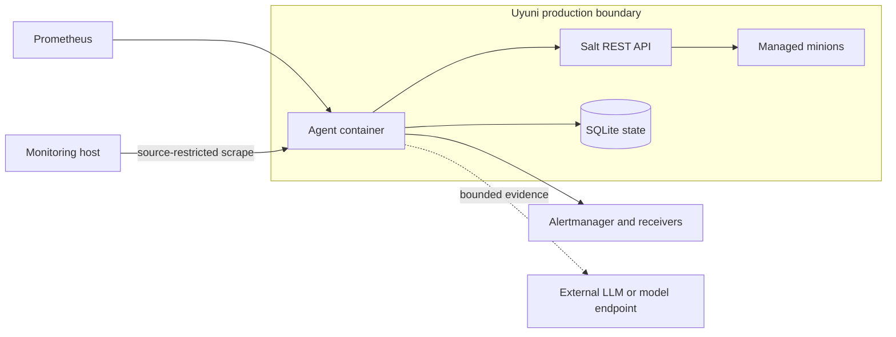

# Security model

## Scope

The agent observes production infrastructure, uses a Salt external-auth
credential, sends selected evidence to an LLM provider, and creates operational
notifications. Its security model therefore covers host access, dependency
authentication, data minimization, prompt/tool boundaries, network exposure,
and safe failure behavior.

This document describes the implemented design and deployment expectations. It
is not a substitute for an environment-specific threat assessment.

## Trust boundaries

The exact boundaries depend on where Prometheus, Alertmanager, and the model
endpoint run. Treat any external model or notification provider as outside the
Uyuni administrative trust boundary unless deployment policy proves otherwise.

## Assets to protect

- Salt API username and password.
- LLM and tracing API keys.
- Uyuni and minion topology.
- Operational evidence, service names, and filesystem paths.
- Incident lifecycle and notification payloads in SQLite.
- Alertmanager receivers and message history.
- Availability of Salt, Prometheus, the model, and the agent queue.

## Salt permissions

The runtime uses Salt functions including `cmd.run`, `disk.usage`, and
`service.status`. `cmd.run` is a powerful primitive even when the application
only constructs fixed diagnostic commands. Application validation reduces the
risk of accidental or model-selected arbitrary execution, but it does not make
a leaked Salt credential harmless.

Production requirements:

1. use a dedicated external-auth identity rather than a human administrator;
2. restrict the identity to the intended minion targets and necessary Salt
   functions;
3. keep the credential in the root-readable environment file;
4. restrict access to Salt port 9080 by host firewall or private network;
5. use TLS with a verified certificate where the connection crosses an
   untrusted network;
6. rotate the credential after suspected disclosure; and
7. audit Salt calls independently of agent logs where possible.

The repository's `sync-agent-salt-secret.sh` installs the Uyuni internal Salt
credential without printing it. Review that use against local policy: an
internal administrative credential may carry broader authority than a custom
least-privilege identity.

## Tool boundary

The LLM does not receive a generic shell-execution tool. Tools have named,
narrow purposes such as service status, bounded logs, listening ports, disk
usage, pressure snapshots, and fixed PostgreSQL inspection.

Tool implementations must validate target identifiers and user-controlled
arguments, construct commands in code, cap requested line counts and output,
and avoid state-changing operations. New tools require security review because
they expand the model's operational capability.

Residual risk remains in any code path that constructs shell commands or uses
`cmd.run`. Tests should include shell metacharacters, unexpected Unicode,
overlong values, path traversal, and invalid unit names.

## LLM data boundary

The model may receive incident prompts and bounded evidence required for the
investigation. The design intentionally excludes or minimizes:

- credentials and API keys;
- raw SQL statement text and literals;
- unrestricted process command lines and arguments;
- arbitrary full log archives;
- evidence older than the configured quality window; and
- unrelated minion data not needed for the incident.

Before choosing an external provider, document its data retention, training,
regional processing, access control, encryption, and deletion terms. Use a
self-hosted or contractually approved endpoint when production evidence cannot
leave the environment.

LangSmith tracing is disabled by default. Enabling it creates another data
egress path. Review traced prompt and tool content, retention, and project
access before enabling it in production.

## Prompt injection and untrusted text

Logs, service output, filenames, and database metadata are untrusted input. A
message in those sources can attempt to instruct the model.

The main mitigations are capability restriction and post-analysis validation:

- the model can call only registered bounded tools;
- deterministic inspection commands are constructed by application code;
- the final output must conform to a structured schema;
- evidence citations must refer to records actually collected;
- stale, failed, missing, or contradictory records cannot prove a confirmed
  conclusion; and
- high-risk remediation text is filtered.

These controls reduce impact; they do not make model output authoritative. A
human operator remains responsible for production changes.

## Notification safety

The agent recommends remediation but does not execute it. Destructive patterns
including recursive deletion, filesystem formatting, destructive database
commands, reboot/shutdown, and force-kill commands are removed from generated
remediation. Inconclusive investigations are restricted to restoring evidence
and asking an operator to validate the target component.

Alertmanager and downstream chat/email systems may retain operational content.
Restrict receiver membership, avoid public channels, and set retention
appropriate for infrastructure incident data.

## Network exposure

The observability listener exposes unauthenticated read-only endpoints. Its
metrics are deliberately low-cardinality and omit prompts, evidence details,
commands, SQL, credentials, incident IDs, and resource names, but the endpoint
still reveals service health and dependency state.

The production Quadlet publishes it only at `127.0.0.1:19898`. The supplied
systemd socket proxy listens on port 9898 and is protected by a source-specific
nftables rule. Do not publish the container listener directly on all host
interfaces.

## Container and filesystem

The image runs as UID/GID `10001:10001`. Configuration is mounted read-only and
durable state is written to a dedicated named volume. The image should remain
immutable; secrets belong in the environment file and state belongs in the
volume.

Protect backups of the SQLite database because it contains incident target
identity and delivered alert payloads. Do not copy it into bug reports without
review and redaction.

## Dependency and supply-chain controls

The project uses a hash-locked runtime requirements file. CI:

- installs dependencies with `--require-hashes`;
- runs `pip-audit`;
- generates a CycloneDX SBOM;
- builds the container; and
- verifies the non-root user.

Container base images are digest-pinned. Dependency, GitHub Action, model, and
base-image upgrades still require review because a passing vulnerability scan
does not prove behavioral compatibility.

## Logging and tracing

Logs should describe operation names, bounded outcomes, latency, and target
identity only where operationally necessary. Never log credentials, complete
environment files, authorization headers, raw prompts, or unrestricted command
output. Review debug logging before enabling it in production.

Metrics use fixed, bounded labels to avoid both data leakage and cardinality
denial of service.

## Security verification checklist

Before enabling delivery:

1. verify the Salt identity and exact target/function permissions;
2. verify `.env` ownership and mode on the Uyuni host;
3. verify secrets are absent from the image and repository history;
4. verify model and tracing data-processing policy;
5. verify observability is reachable only from the monitoring source;
6. run dependency audit and container build checks;
7. exercise malformed tool inputs and inconclusive evidence paths;
8. confirm Alertmanager receivers are private; and
9. document credential rotation and incident response ownership.

To report a vulnerability, follow the repository [security policy](../SECURITY.md).
